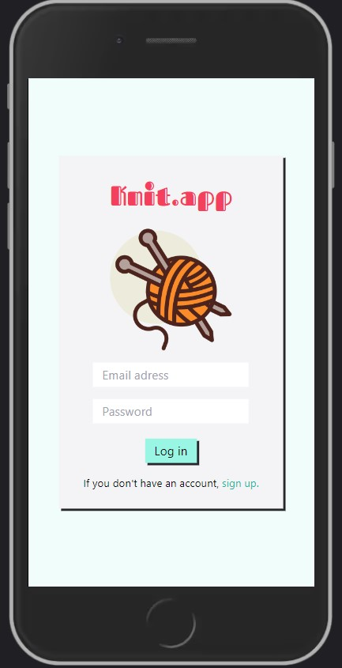
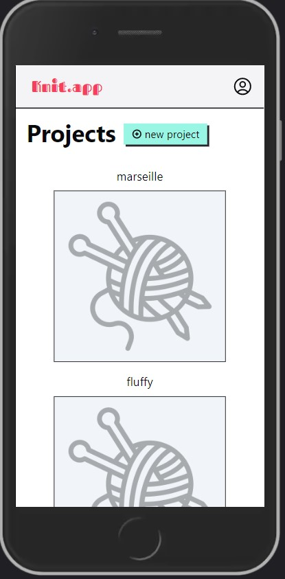
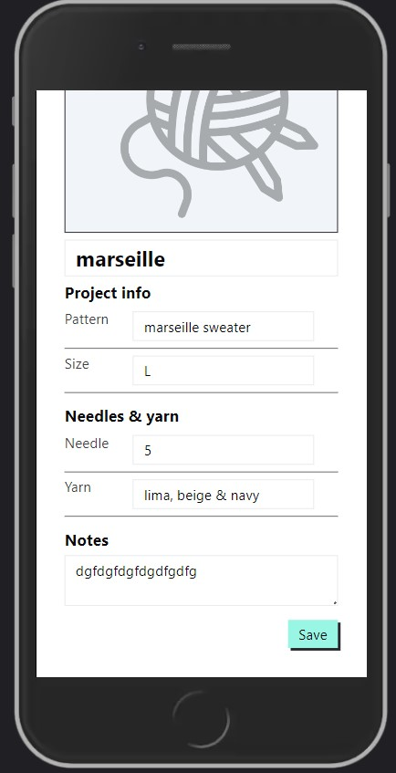
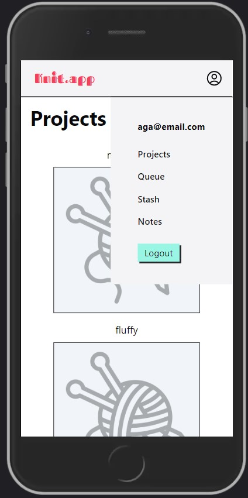

### (still working on refactoring the code and adding funcionalities)

# Knit app

## Contents
* [Deployed app](#deployed-app)
* [Project description](#project-description)
* [Technologies](#technologies)
* [Setup](#setup)
* [Application view](#application-view)

## Deployed app
<b> [Link to the deployed app](https://knit-app.netlify.app/) </b> <br>
To test the app log in with email: tester@email.com and password: testapp123 <br>

## Project description:
- app for storing info about current and finished knitting projects, project queue, yarn stash
- design ispired by [ravelry.com](https://www.ravelry.com/)
- knitting icons: created by Darius Dan and by iconixar - Flaticon

## Technologies
- login with email and password (firebase authentication)
- data stored in Firebase Storage and Firestore Database
- navigation built with React Router 6 (actions, loaders)
- styled with Tailwind CSS
- built with: 


## Setup
Clone the repo <br>
``` git clone https://github.com/agnkos/knit-app.git ``` <br>
Install npm packages <br>
``` npm install ``` <br>
Run the app <br>
``` npm run dev ``` <br>

## Application view:

 
 
 
 


#### Completed:
- login and signup page
- all projects page
- adding and editing projects
- adding and deleting project photo
- queue: adding, deleting, editing items
- queue: changing item position
- stash page: adding & deleting items, images
